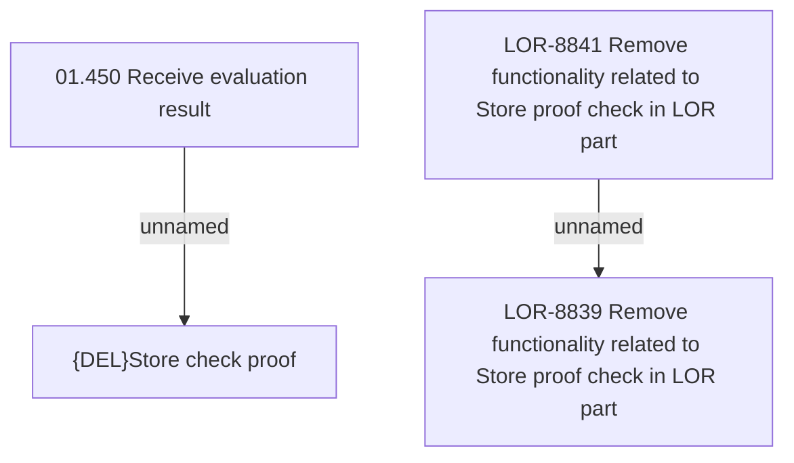

# LOR-8839 Remove functionality related to Store proof check in LOR part

```mermaid
graph TD
    n_01_450_Receive_evaluation_result["01.450 Receive evaluation result"]
    LOR_8841_Remove_functionality_related_to_Store_proof_check_i["LOR-8841 Remove functionality related to Store proof check in LOR part"]
    LOR_8839_Remove_functionality_related_to_Store_proof_check_i["LOR-8839 Remove functionality related to Store proof check in LOR part"]
    DEL_Store_check_proof["{DEL}Store check proof"]
    LOR_8841_Remove_functionality_related_to_Store_proof_check_i -->|unnamed| LOR_8839_Remove_functionality_related_to_Store_proof_check_i
    n_01_450_Receive_evaluation_result -->|unnamed| DEL_Store_check_proof
```
