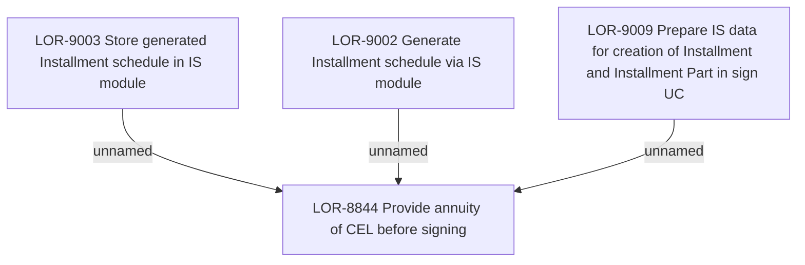

# LOR-8844 Provide annuity of CEL before signing

- **Diagram Type**: Custom
- **Package**: HomerSelect/BSL/Requirements Model/Finished/LOR/LOR-8844 Provide annuity of CEL before signing
- **Diagram ID**: 150773
- **Elements**: 4
- **Connectors**: 3

