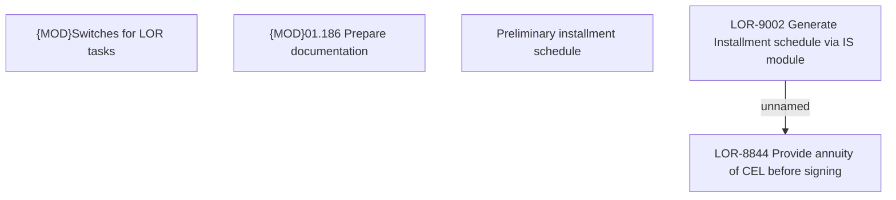

# LOR-9002 Generate Installment schedule via IS module

- **Diagram Type**: Custom
- **Package**: HomerSelect/BSL/Requirements Model/Finished/LOR/LOR-8844 Provide annuity of CEL before signing/LOR-9002 Generate Installment schedule via IS module
- **Diagram ID**: 150774
- **Elements**: 5
- **Connectors**: 1

