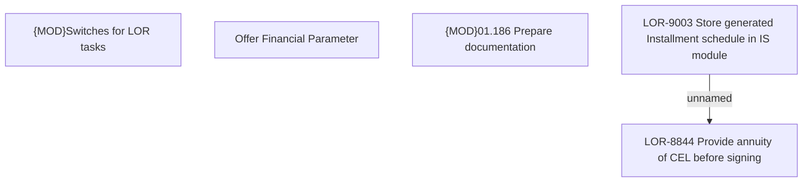

# LOR-9003 Store generated Installment schedule in IS module

```mermaid
graph TD
    MOD_Switches_for_LOR_tasks["{MOD}Switches for LOR tasks"]
    Offer_Financial_Parameter["Offer Financial Parameter"]
    MOD_01_186_Prepare_documentation["{MOD}01.186 Prepare documentation"]
    LOR_9003_Store_generated_Installment_schedule_in_IS_module["LOR-9003 Store generated Installment schedule in IS module"]
    LOR_8844_Provide_annuity_of_CEL_before_signing["LOR-8844 Provide annuity of CEL before signing"]
    LOR_9003_Store_generated_Installment_schedule_in_IS_module -->|unnamed| LOR_8844_Provide_annuity_of_CEL_before_signing
```
