# LOR-9007 Create installment schedule when offer chosen for application

- **Diagram Type**: Custom
- **Package**: HomerSelect/BSL/Requirements Model/Finished/LOR/LOR-8844 Provide annuity of CEL before signing/LOR-9007 Create installment schedule when offer chosen for application
- **Diagram ID**: 150776
- **Elements**: 9
- **Connectors**: 7

```mermaid
graph TD
    MOD_02_830_Recalculate_Product_Offers_for_External_system["{MOD}02.830 Recalculate Product Offers for External system"]
    n_08_110_Select_insurance_services["08.110 Select insurance services"]
    n_01_311_Update_offer_to_application_and_evaluate["01.311 Update offer to application and evaluate"]
    Generate_offer_installment["Generate offer installment"]
    Application_Processing["Application Processing"]
    n_01_167_Accept_offer_externally["01.167 Accept offer externally"]
    n_01_158_Accept_offer["01.158 Accept offer"]
    LOR_9007_Create_installment_schedule_when_offer_chosen_for_a["LOR-9007 Create installment schedule when offer chosen for application"]
    LOR_8844_Provide_annuity_of_CEL_before_signing["LOR-8844 Provide annuity of CEL before signing"]
    LOR_9007_Create_installment_schedule_when_offer_chosen_for_a -->|unnamed| LOR_8844_Provide_annuity_of_CEL_before_signing
    Application_Processing -->|unnamed| Generate_offer_installment
    n_01_311_Update_offer_to_application_and_evaluate -->|unnamed| Generate_offer_installment
    n_01_158_Accept_offer -->|unnamed| Generate_offer_installment
    n_01_167_Accept_offer_externally -->|unnamed| Generate_offer_installment
    MOD_02_830_Recalculate_Product_Offers_for_External_system -->|unnamed| Generate_offer_installment
    n_08_110_Select_insurance_services -->|unnamed| Generate_offer_installment
```

