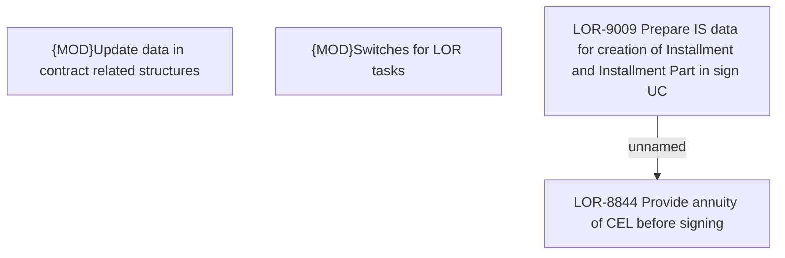

# LOR-9009 Prepare IS data for creation of Installment and Installment Part in sign UC

- **Diagram Type**: Custom
- **Package**: HomerSelect/BSL/Requirements Model/Finished/LOR/LOR-8844 Provide annuity of CEL before signing/LOR-9009 Prepare IS data for creation of Installment and Installment Part in sign UC
- **Diagram ID**: 150777
- **Elements**: 4
- **Connectors**: 1

