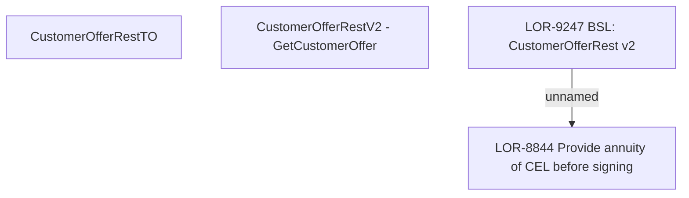

# LOR-9247 BSL: CustomerOfferRest v2

- **Diagram Type**: Custom
- **Package**: HomerSelect/BSL/Requirements Model/Finished/LOR/LOR-8844 Provide annuity of CEL before signing/LOR-9247 BSL: CustomerOfferRest v2
- **Diagram ID**: 150778
- **Elements**: 4
- **Connectors**: 1

