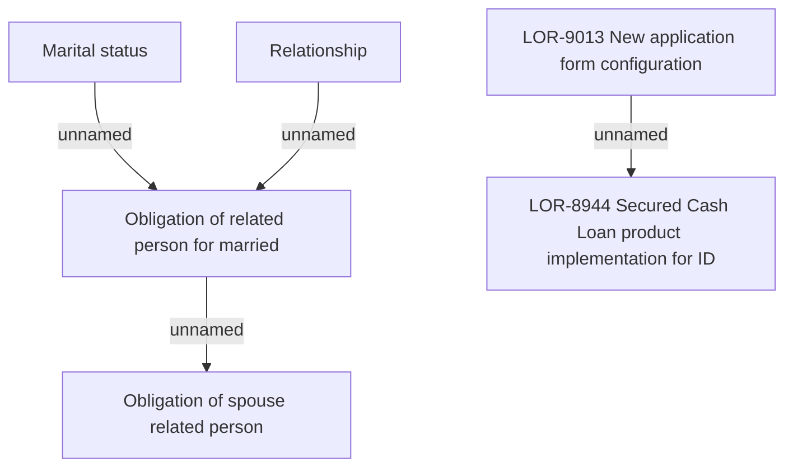

# LOR-8944 Secured Cash Loan product implementation for ID

```mermaid
graph TD
    Relationship["Relationship"]
    Marital_status["Marital status"]
    Obligation_of_spouse_related_person["Obligation of spouse related person"]
    Obligation_of_related_person_for_married["Obligation of related person for married"]
    LOR_9013_New_application_form_configuration["LOR-9013 New application form configuration"]
    LOR_8944_Secured_Cash_Loan_product_implementation_for_ID["LOR-8944 Secured Cash Loan product implementation for ID"]
    Marital_status -->|unnamed| Obligation_of_related_person_for_married
    Relationship -->|unnamed| Obligation_of_related_person_for_married
    LOR_9013_New_application_form_configuration -->|unnamed| LOR_8944_Secured_Cash_Loan_product_implementation_for_ID
    Obligation_of_related_person_for_married -->|unnamed| Obligation_of_spouse_related_person
```
