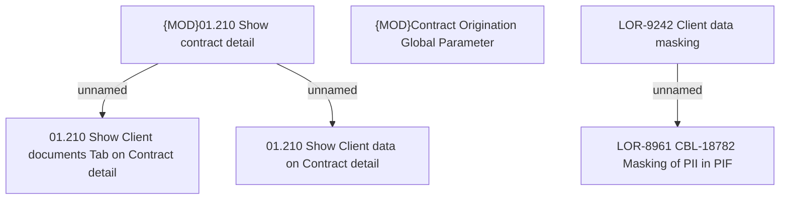

# LOR-8961 CBL-18782 Masking of PII in PIF

```mermaid
graph TD
    n_01_210_Show_Client_data_on_Contract_detail["01.210 Show Client data on Contract detail"]
    MOD_01_210_Show_contract_detail["{MOD}01.210 Show contract detail"]
    MOD_Contract_Origination_Global_Parameter["{MOD}Contract Origination Global Parameter"]
    n_01_210_Show_Client_documents_Tab_on_Contract_detail["01.210 Show Client documents Tab on Contract detail"]
    LOR_8961_CBL_18782_Masking_of_PII_in_PIF["LOR-8961 CBL-18782 Masking of PII in PIF"]
    LOR_9242_Client_data_masking["LOR-9242 Client data masking"]
    LOR_9242_Client_data_masking -->|unnamed| LOR_8961_CBL_18782_Masking_of_PII_in_PIF
    MOD_01_210_Show_contract_detail -->|unnamed| n_01_210_Show_Client_documents_Tab_on_Contract_detail
    MOD_01_210_Show_contract_detail -->|unnamed| n_01_210_Show_Client_data_on_Contract_detail
```
