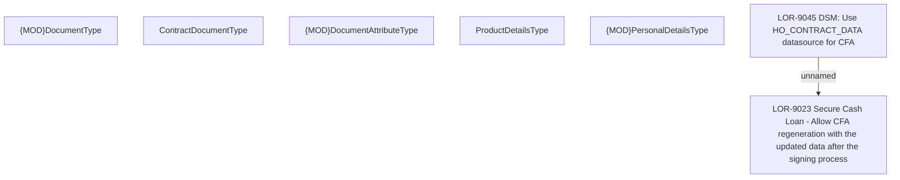

# LOR-9045 DSM: Use HO_CONTRACT_DATA datasource for CFA

- **Diagram Type**: Custom
- **Package**: HomerSelect/BSL/Requirements Model/Finished/LOR/LOR-9023 Secure Cash Loan - Allow CFA regeneration with the updated data after the signing process/LOR-9045 DSM: Use HO_CONTRACT_DATA datasource for CFA
- **Diagram ID**: 148960
- **Elements**: 7
- **Connectors**: 1

