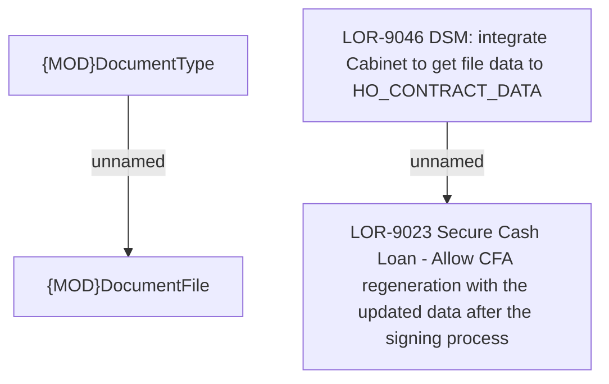

# LOR-9046 DSM: integrate Cabinet to get file data to HO_CONTRACT_DATA

- **Diagram Type**: Custom
- **Package**: HomerSelect/BSL/Requirements Model/Finished/LOR/LOR-9023 Secure Cash Loan - Allow CFA regeneration with the updated data after the signing process/LOR-9046 DSM: integrate Cabinet to get file data to HO_CONTRACT_DATA
- **Diagram ID**: 148961
- **Elements**: 4
- **Connectors**: 2

