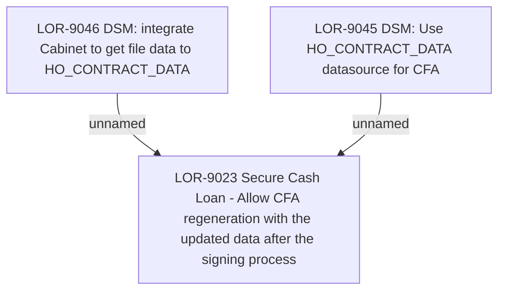

# LOR-9023 Secure Cash Loan - Allow CFA regeneration with the updated data after the signing process

- **Diagram Type**: Custom
- **Package**: HomerSelect/BSL/Requirements Model/Finished/LOR/LOR-9023 Secure Cash Loan - Allow CFA regeneration with the updated data after the signing process
- **Diagram ID**: 148959
- **Elements**: 3
- **Connectors**: 2

