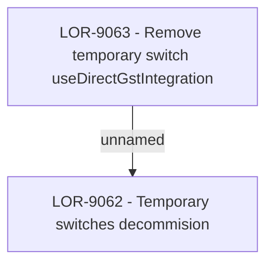

# LOR-9062 - Temporary switches decommision

```mermaid
graph TD
    LOR_9063_Remove_temporary_switch_useDirectGstIntegration["LOR-9063 - Remove temporary switch useDirectGstIntegration"]
    LOR_9063_Remove_temporary_switch_useDirectGstIntegration["LOR-9063 - Remove temporary switch useDirectGstIntegration"]
    LOR_9062_Temporary_switches_decommision["LOR-9062 - Temporary switches decommision"]
    LOR_9063_Remove_temporary_switch_useDirectGstIntegration -->|unnamed| LOR_9062_Temporary_switches_decommision
```
