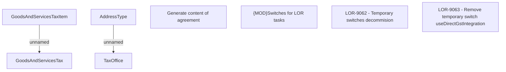

# LOR-9063 - Remove temporary switch useDirectGstIntegration

```mermaid
graph TD
    GoodsAndServicesTax["GoodsAndServicesTax"]
    GoodsAndServicesTaxItem["GoodsAndServicesTaxItem"]
    TaxOffice["TaxOffice"]
    AddressType["AddressType"]
    Generate_content_of_agreement["Generate content of agreement"]
    MOD_Switches_for_LOR_tasks["{MOD}Switches for LOR tasks"]
    LOR_9062_Temporary_switches_decommision["LOR-9062 - Temporary switches decommision"]
    LOR_9063_Remove_temporary_switch_useDirectGstIntegration["LOR-9063 - Remove temporary switch useDirectGstIntegration"]
    GoodsAndServicesTaxItem -->|unnamed| GoodsAndServicesTax
    AddressType -->|unnamed| TaxOffice
```
