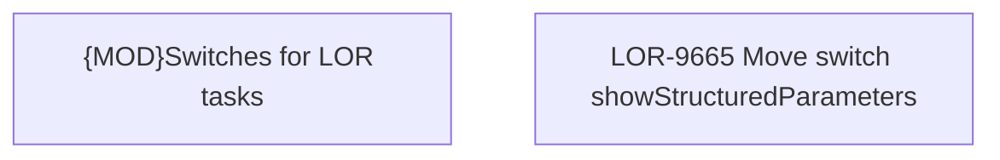

# LOR-9665 Move switch showStructuredParameters

- **Diagram Type**: Custom
- **Package**: HomerSelect/BSL/Requirements Model/Finished/LOR/LOR-9062 - Temporary switches decommision/LOR-9665 Move switch showStructuredParameters
- **Diagram ID**: 157982
- **Elements**: 2
- **Connectors**: 0

