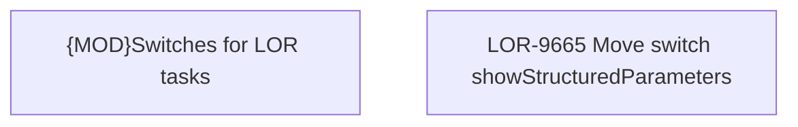

# LOR-9665 Move switch showStructuredParameters

```mermaid
graph TD
    MOD_Switches_for_LOR_tasks["{MOD}Switches for LOR tasks"]
    LOR_9665_Move_switch_showStructuredParameters["LOR-9665 Move switch showStructuredParameters"]
```
