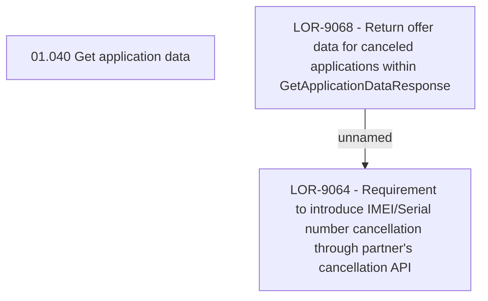

# LOR-9064 - Requirement to introduce IMEI/Serial number cancellation through partner's cancellation API

- **Diagram Type**: Custom
- **Package**: HomerSelect/BSL/Requirements Model/Finished/LOR/LOR-9064 - Requirement to introduce IMEI/Serial number cancellation through partner's cancellation API
- **Diagram ID**: 149303
- **Elements**: 3
- **Connectors**: 1

