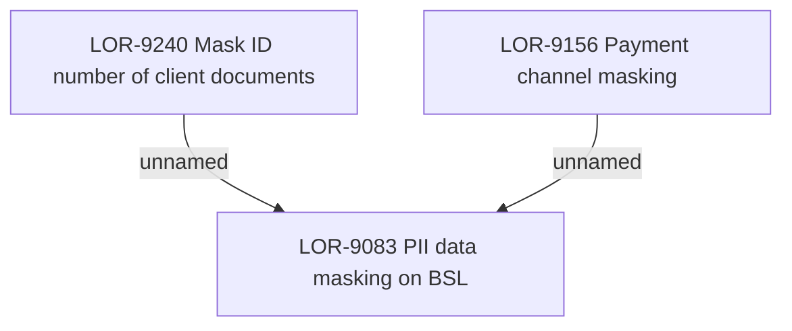

# LOR-9083 PII data masking on BSL

```mermaid
graph TD
    LOR_9240_Mask_ID_number_of_client_documents["LOR-9240 Mask ID number of client documents"]
    LOR_9156_Payment_channel_masking["LOR-9156 Payment channel masking"]
    LOR_9083_PII_data_masking_on_BSL["LOR-9083 PII data masking on BSL"]
    LOR_9240_Mask_ID_number_of_client_documents -->|unnamed| LOR_9083_PII_data_masking_on_BSL
    LOR_9156_Payment_channel_masking -->|unnamed| LOR_9083_PII_data_masking_on_BSL
```
