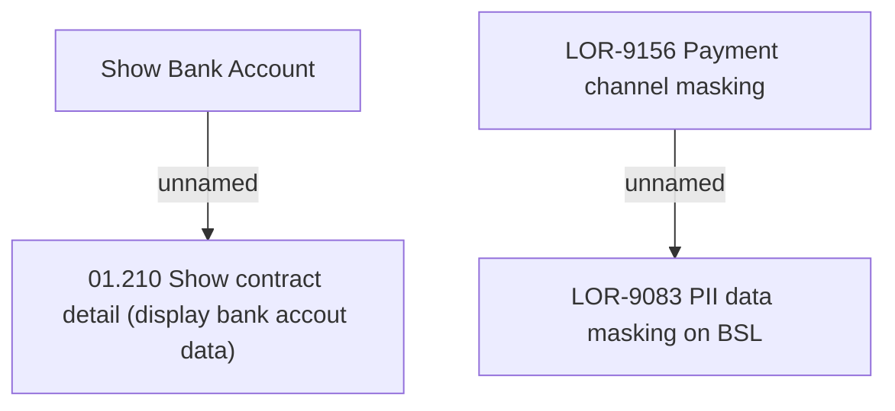

# LOR-9156 Payment channel masking

- **Diagram Type**: Custom
- **Package**: HomerSelect/BSL/Requirements Model/Finished/LOR/LOR-9083 PII data masking on BSL/LOR-9156 Payment channel masking
- **Diagram ID**: 150639
- **Elements**: 4
- **Connectors**: 2

