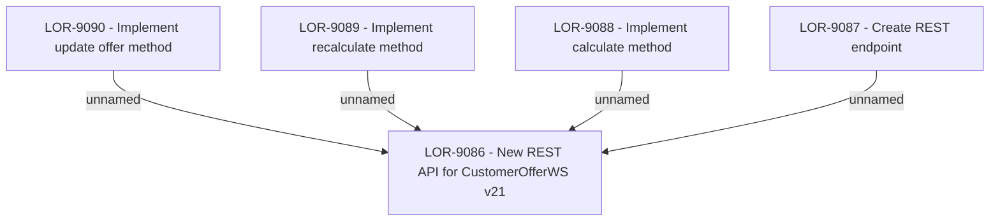

# LOR-9086 - New REST API for CustomerOfferWS v21

- **Diagram Type**: Custom
- **Package**: HomerSelect/BSL/Requirements Model/Finished/LOR/LOR-9086 - New REST API for CustomerOfferWS v21
- **Diagram ID**: 149666
- **Elements**: 9
- **Connectors**: 4

