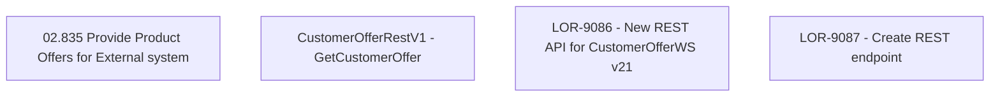

# LOR-9087 - Create REST endpoint

- **Diagram Type**: Custom
- **Package**: HomerSelect/BSL/Requirements Model/Finished/LOR/LOR-9086 - New REST API for CustomerOfferWS v21/LOR-9087 - Create REST endpoint
- **Diagram ID**: 149667
- **Elements**: 4
- **Connectors**: 0

