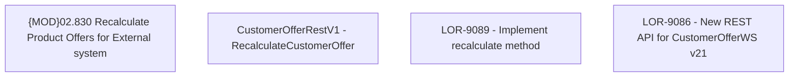

# LOR-9089 - Implement recalculate method

- **Diagram Type**: Custom
- **Package**: HomerSelect/BSL/Requirements Model/Finished/LOR/LOR-9086 - New REST API for CustomerOfferWS v21/LOR-9089 - Implement recalculate method
- **Diagram ID**: 149669
- **Elements**: 4
- **Connectors**: 0

