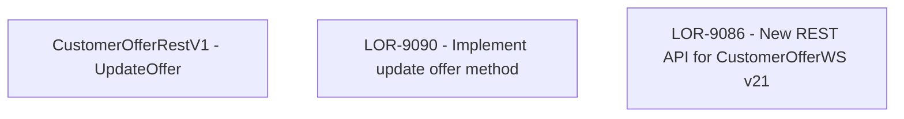

# LOR-9090 - Implement update offer method

- **Diagram Type**: Custom
- **Package**: HomerSelect/BSL/Requirements Model/Finished/LOR/LOR-9086 - New REST API for CustomerOfferWS v21/LOR-9090 - Implement update offer method
- **Diagram ID**: 149670
- **Elements**: 3
- **Connectors**: 0

