# LOR-9105 Create a new attribute for SOB (Selling On Board)

- **Diagram Type**: Custom
- **Package**: HomerSelect/BSL/Requirements Model/Finished/LOR/LOR-9105 Create a new attribute for SOB (Selling On Board)
- **Diagram ID**: 150838
- **Elements**: 9
- **Connectors**: 8

```mermaid
graph TD
    LOR_9261_Fill_in_businessActor_in_DMS_request["LOR-9261 Fill in businessActor in DMS request"]
    LOR_9186_Upload_contractual_documentation_via_DMS["LOR-9186 Upload contractual documentation via DMS"]
    LOR_9168_Implement_evaluateApplication_cancel_methods["LOR-9168 Implement evaluateApplication + cancel methods"]
    LOR_9166_Implement_createAndEvaluateApplication_methods["LOR-9166 Implement createAndEvaluateApplication methods"]
    LOR_9174_Implement_getAgreement_method["LOR-9174 Implement getAgreement method"]
    LOR_9173_Implement_search_method["LOR-9173 Implement search method"]
    LOR_9172_Implement_prepareAgreement_signAgreement_methods["LOR-9172 Implement prepareAgreement + signAgreement methods"]
    LOR_9105_Create_a_new_attribute_for_SOB_Selling_On_Board["LOR-9105 Create a new attribute for SOB (Selling On Board)"]
    LOR_9155_Create_ApplicationManagement_REST_Endpoint_GET_meth["LOR-9155 Create ApplicationManagement REST Endpoint + GET method"]
    LOR_9261_Fill_in_businessActor_in_DMS_request -->|unnamed| LOR_9105_Create_a_new_attribute_for_SOB_Selling_On_Board
    LOR_9186_Upload_contractual_documentation_via_DMS -->|unnamed| LOR_9105_Create_a_new_attribute_for_SOB_Selling_On_Board
    LOR_9168_Implement_evaluateApplication_cancel_methods -->|unnamed| LOR_9105_Create_a_new_attribute_for_SOB_Selling_On_Board
    LOR_9166_Implement_createAndEvaluateApplication_methods -->|unnamed| LOR_9105_Create_a_new_attribute_for_SOB_Selling_On_Board
    LOR_9174_Implement_getAgreement_method -->|unnamed| LOR_9105_Create_a_new_attribute_for_SOB_Selling_On_Board
    LOR_9173_Implement_search_method -->|unnamed| LOR_9105_Create_a_new_attribute_for_SOB_Selling_On_Board
    LOR_9172_Implement_prepareAgreement_signAgreement_methods -->|unnamed| LOR_9105_Create_a_new_attribute_for_SOB_Selling_On_Board
    LOR_9155_Create_ApplicationManagement_REST_Endpoint_GET_meth -->|unnamed| LOR_9105_Create_a_new_attribute_for_SOB_Selling_On_Board
```

