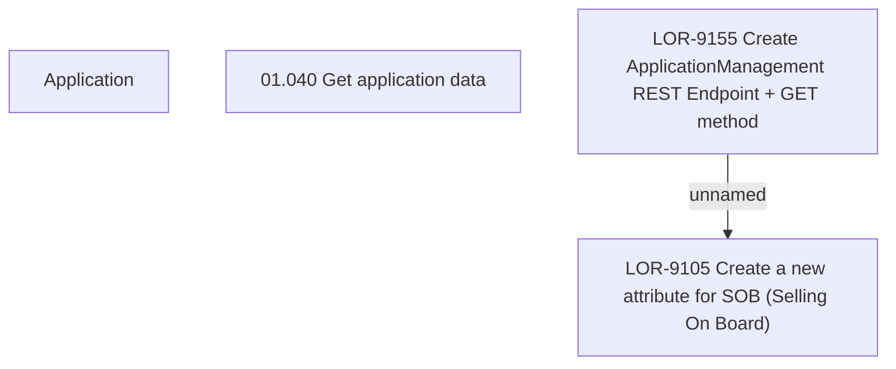

# LOR-9155 Create ApplicationManagement REST Endpoint + GET method

- **Diagram Type**: Custom
- **Package**: HomerSelect/BSL/Requirements Model/Finished/LOR/LOR-9105 Create a new attribute for SOB (Selling On Board)/LOR-9155 Create ApplicationManagement REST Endpoint + GET method
- **Diagram ID**: 150839
- **Elements**: 5
- **Connectors**: 1

