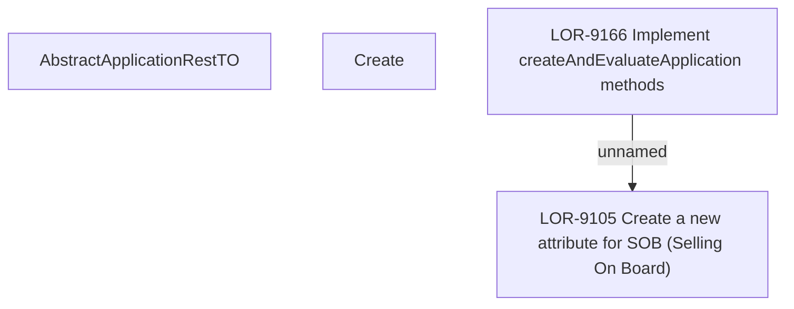

# LOR-9166 Implement createAndEvaluateApplication methods

- **Diagram Type**: Custom
- **Package**: HomerSelect/BSL/Requirements Model/Finished/LOR/LOR-9105 Create a new attribute for SOB (Selling On Board)/LOR-9166 Implement createAndEvaluateApplication methods
- **Diagram ID**: 150840
- **Elements**: 4
- **Connectors**: 1

