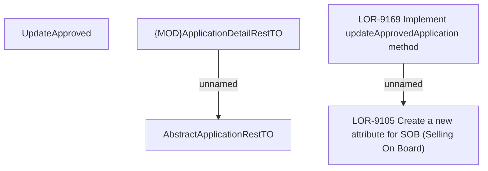

# LOR-9169 Implement updateApprovedApplication method

- **Diagram Type**: Custom
- **Package**: HomerSelect/BSL/Requirements Model/Finished/LOR/LOR-9105 Create a new attribute for SOB (Selling On Board)/LOR-9169 Implement updateApprovedApplication method
- **Diagram ID**: 150842
- **Elements**: 5
- **Connectors**: 2

