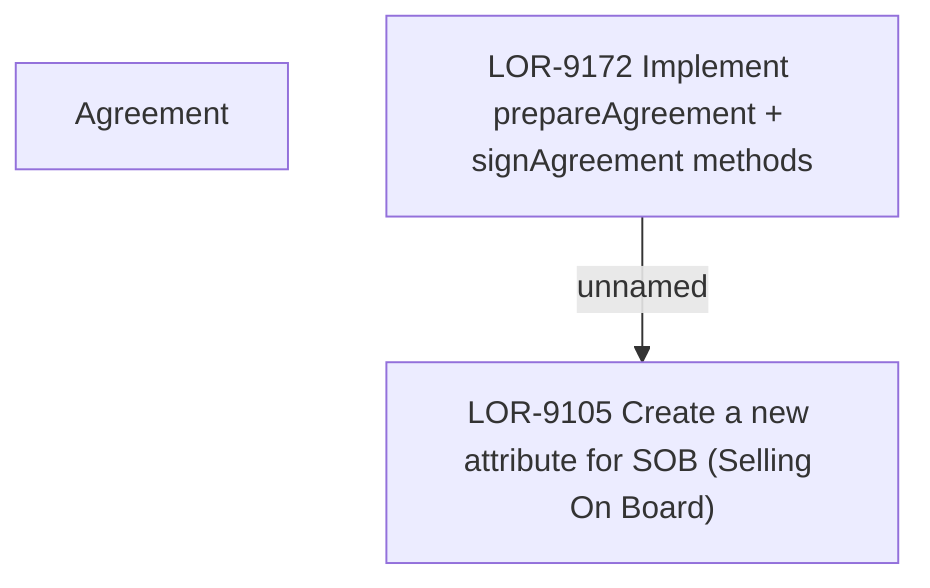

# LOR-9172 Implement prepareAgreement + signAgreement methods

```mermaid
graph TD
    Agreement["Agreement"]
    LOR_9172_Implement_prepareAgreement_signAgreement_methods["LOR-9172 Implement prepareAgreement + signAgreement methods"]
    LOR_9105_Create_a_new_attribute_for_SOB_Selling_On_Board["LOR-9105 Create a new attribute for SOB (Selling On Board)"]
    LOR_9172_Implement_prepareAgreement_signAgreement_methods -->|unnamed| LOR_9105_Create_a_new_attribute_for_SOB_Selling_On_Board
```
