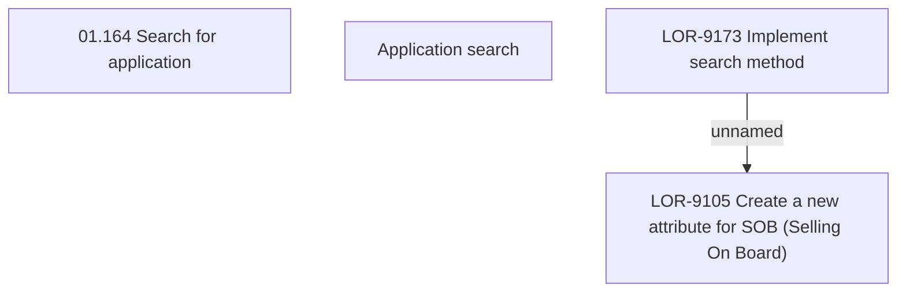

# LOR-9173 Implement search method

```mermaid
graph TD
    n_01_164_Search_for_application["01.164 Search for application"]
    Application_search["Application search"]
    LOR_9173_Implement_search_method["LOR-9173 Implement search method"]
    LOR_9105_Create_a_new_attribute_for_SOB_Selling_On_Board["LOR-9105 Create a new attribute for SOB (Selling On Board)"]
    LOR_9173_Implement_search_method -->|unnamed| LOR_9105_Create_a_new_attribute_for_SOB_Selling_On_Board
```
