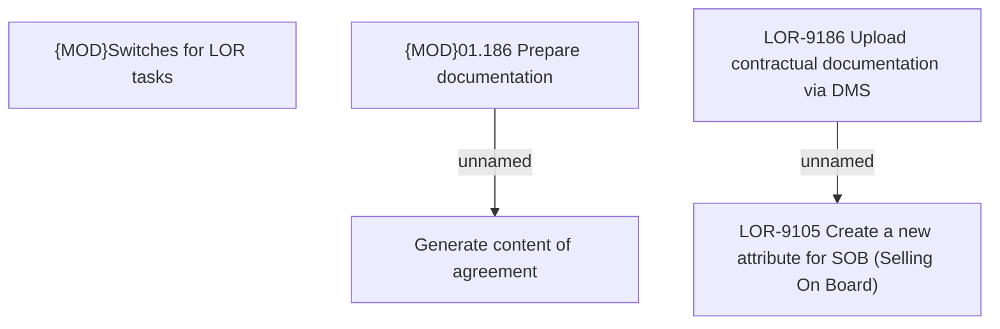

# LOR-9186 Upload contractual documentation via DMS

```mermaid
graph TD
    MOD_Switches_for_LOR_tasks["{MOD}Switches for LOR tasks"]
    Generate_content_of_agreement["Generate content of agreement"]
    MOD_01_186_Prepare_documentation["{MOD}01.186 Prepare documentation"]
    LOR_9186_Upload_contractual_documentation_via_DMS["LOR-9186 Upload contractual documentation via DMS"]
    LOR_9105_Create_a_new_attribute_for_SOB_Selling_On_Board["LOR-9105 Create a new attribute for SOB (Selling On Board)"]
    LOR_9186_Upload_contractual_documentation_via_DMS -->|unnamed| LOR_9105_Create_a_new_attribute_for_SOB_Selling_On_Board
    MOD_01_186_Prepare_documentation -->|unnamed| Generate_content_of_agreement
```
