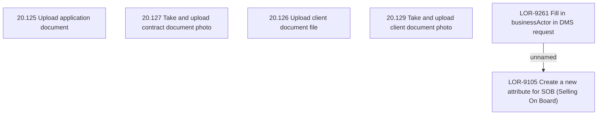

# LOR-9261 Fill in businessActor in DMS request

```mermaid
graph TD
    n_20_125_Upload_application_document["20.125 Upload application document"]
    n_20_127_Take_and_upload_contract_document_photo["20.127 Take and upload contract document photo"]
    n_20_126_Upload_client_document_file["20.126 Upload client document file"]
    n_20_129_Take_and_upload_client_document_photo["20.129 Take and upload client document photo"]
    LOR_9261_Fill_in_businessActor_in_DMS_request["LOR-9261 Fill in businessActor in DMS request"]
    LOR_9105_Create_a_new_attribute_for_SOB_Selling_On_Board["LOR-9105 Create a new attribute for SOB (Selling On Board)"]
    LOR_9261_Fill_in_businessActor_in_DMS_request -->|unnamed| LOR_9105_Create_a_new_attribute_for_SOB_Selling_On_Board
```
