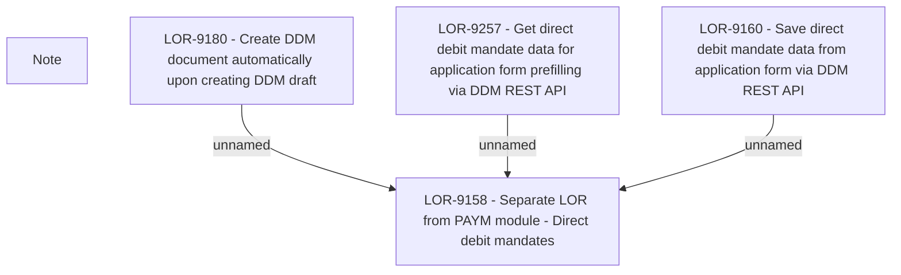

# LOR-9158 - Separate LOR from PAYM module - Direct debit mandates

- **Diagram Type**: Custom
- **Package**: HomerSelect/BSL/Requirements Model/Finished/LOR/LOR-9158 - Separate LOR from PAYM module - Direct debit mandates
- **Diagram ID**: 150758
- **Elements**: 8
- **Connectors**: 3

