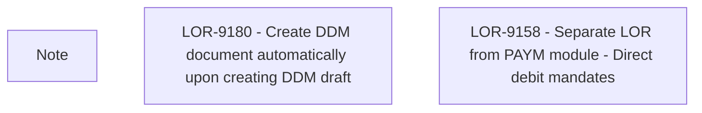

# LOR-9180 - Create DDM document automatically upon creating DDM draft

```mermaid
graph TD
    el_1744477["Note"]
    LOR_9180_Create_DDM_document_automatically_upon_creating_DDM["LOR-9180 - Create DDM document automatically upon creating DDM draft"]
    LOR_9158_Separate_LOR_from_PAYM_module_Direct_debit_mandates["LOR-9158 - Separate LOR from PAYM module - Direct debit mandates"]
```
