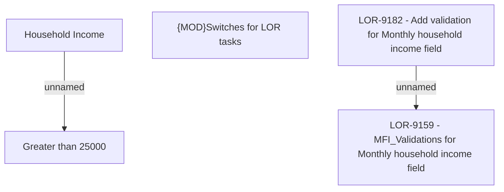

# LOR-9159 - MFI_Validations for Monthly household income field

- **Diagram Type**: Custom
- **Package**: HomerSelect/BSL/Requirements Model/Finished/LOR/LOR-9159 - MFI_Validations for Monthly household income field
- **Diagram ID**: 150224
- **Elements**: 5
- **Connectors**: 2

