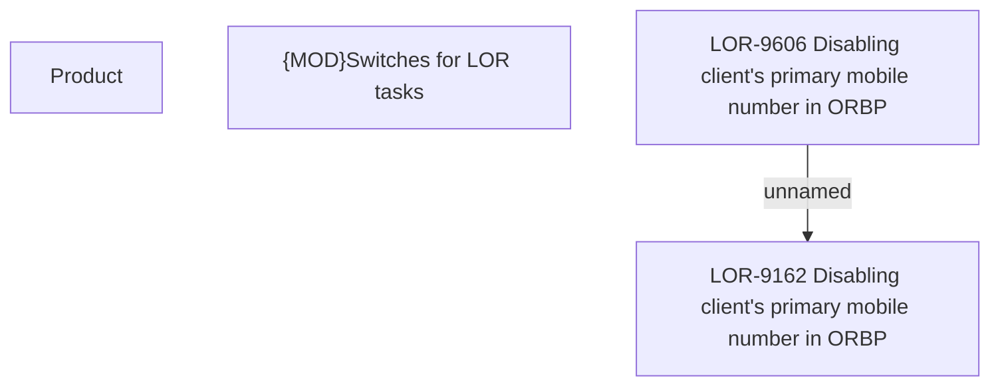

# LOR-9162 Disabling client's primary mobile number in ORBP

- **Diagram Type**: Custom
- **Package**: HomerSelect/BSL/Requirements Model/Finished/LOR/LOR-9162 Disabling client's primary mobile number in ORBP
- **Diagram ID**: 152963
- **Elements**: 5
- **Connectors**: 1

