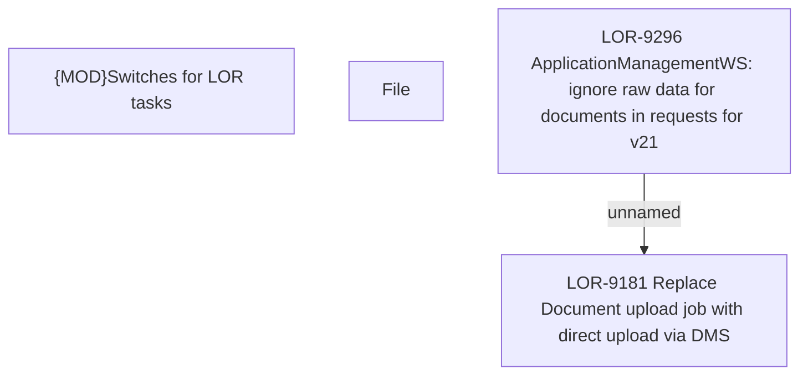

# LOR-9296 ApplicationManagementWS: ignore raw data for documents in requests for v21

- **Diagram Type**: Custom
- **Package**: HomerSelect/BSL/Requirements Model/Finished/LOR/LOR-9181 Replace Document upload job with direct upload via DMS/LOR-9296 ApplicationManagementWS: ignore raw data for documents in requests for v21
- **Diagram ID**: 152729
- **Elements**: 4
- **Connectors**: 1

