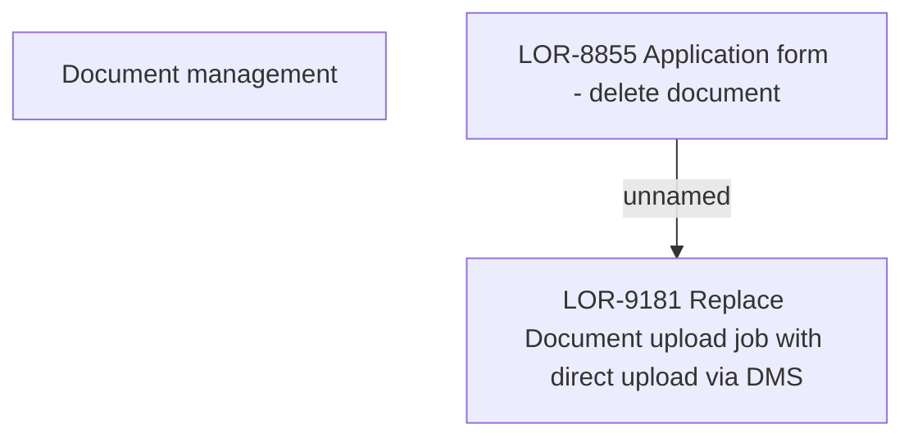

# LOR-8855 Application form - delete document

- **Diagram Type**: Custom
- **Package**: HomerSelect/BSL/Requirements Model/Finished/LOR/LOR-9181 Replace Document upload job with direct upload via DMS/LOR-8855 Application form - delete document
- **Diagram ID**: 152725
- **Elements**: 3
- **Connectors**: 1

