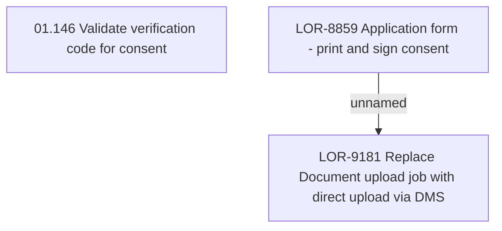

# LOR-8859 Application form - print & sign consent

- **Diagram Type**: Custom
- **Package**: HomerSelect/BSL/Requirements Model/Finished/LOR/LOR-9181 Replace Document upload job with direct upload via DMS/LOR-8859 Application form - print & sign consent
- **Diagram ID**: 152726
- **Elements**: 3
- **Connectors**: 1

