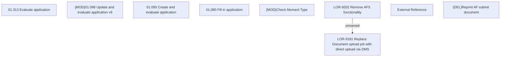

# LOR-9202 Remove AFS functionality

```mermaid
graph TD
    n_01_313_Evaluate_application["01.313 Evaluate application"]
    MOD_01_098_Update_and_evaluate_application_v9["{MOD}01.098 Update and evaluate application v9"]
    n_01_095_Create_and_evaluate_application["01.095 Create and evaluate application"]
    n_01_080_Fill_in_application["01.080 Fill in application"]
    MOD_Check_Moment_Type["{MOD}Check Moment Type"]
    LOR_9202_Remove_AFS_functionality["LOR-9202 Remove AFS functionality"]
    LOR_9181_Replace_Document_upload_job_with_direct_upload_via_["LOR-9181 Replace Document upload job with direct upload via DMS"]
    External_Reference["External Reference"]
    DEL_Reprint_AF_submit_document["{DEL}Reprint AF submit document"]
    LOR_9202_Remove_AFS_functionality -->|unnamed| LOR_9181_Replace_Document_upload_job_with_direct_upload_via_
```
