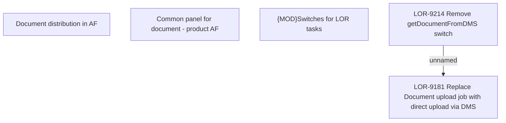

# LOR-9214 Remove getDocumentFromDMS switch

- **Diagram Type**: Custom
- **Package**: HomerSelect/BSL/Requirements Model/Finished/LOR/LOR-9181 Replace Document upload job with direct upload via DMS/LOR-9214 Remove getDocumentFromDMS switch
- **Diagram ID**: 152728
- **Elements**: 5
- **Connectors**: 1

