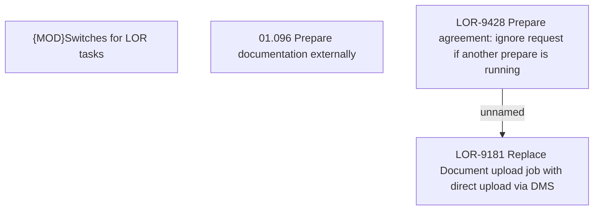

# LOR-9428 Prepare agreement: ignore request if another prepare is running

- **Diagram Type**: Custom
- **Package**: HomerSelect/BSL/Requirements Model/Finished/LOR/LOR-9181 Replace Document upload job with direct upload via DMS/LOR-9428 Prepare agreement: ignore request if another prepare is running
- **Diagram ID**: 152730
- **Elements**: 4
- **Connectors**: 1

