# LOR-9195 Top Up New Product Set Up - Loan Origination

- **Diagram Type**: Custom
- **Package**: HomerSelect/BSL/Requirements Model/Finished/LOR/LOR-9195 Top Up New Product Set Up - Loan Origination
- **Diagram ID**: 152416
- **Elements**: 8
- **Connectors**: 7

```mermaid
graph TD
    LOR_9461_Prepare_agreement_Recalculate_fee["LOR-9461 Prepare agreement: Recalculate fee"]
    LOR_9467_Count_of_future_installments["LOR-9467 Count of future installments"]
    LOR_9436_Calculate_offer_for_TopUp["LOR-9436 Calculate offer for TopUp"]
    LOR_9394_Remove_non_relevant_active_cash_loans["LOR-9394 Remove non relevant active cash loans"]
    LOR_9375_TopUp_contract_selection_algorithm_update["LOR-9375 TopUp contract selection - algorithm update"]
    LOR_9317_UI_Product_calculator_offer_and_contract_selection["LOR-9317 UI Product calculator: offer and contract selection"]
    LOR_9293_Prepare_available_active_contracts_for_Top_Up["LOR-9293 Prepare available active contracts for Top Up"]
    LOR_9195_Top_Up_New_Product_Set_Up_Loan_Origination["LOR-9195 Top Up New Product Set Up - Loan Origination"]
    LOR_9461_Prepare_agreement_Recalculate_fee -->|unnamed| LOR_9195_Top_Up_New_Product_Set_Up_Loan_Origination
    LOR_9467_Count_of_future_installments -->|unnamed| LOR_9195_Top_Up_New_Product_Set_Up_Loan_Origination
    LOR_9436_Calculate_offer_for_TopUp -->|unnamed| LOR_9195_Top_Up_New_Product_Set_Up_Loan_Origination
    LOR_9394_Remove_non_relevant_active_cash_loans -->|unnamed| LOR_9195_Top_Up_New_Product_Set_Up_Loan_Origination
    LOR_9375_TopUp_contract_selection_algorithm_update -->|unnamed| LOR_9195_Top_Up_New_Product_Set_Up_Loan_Origination
    LOR_9317_UI_Product_calculator_offer_and_contract_selection -->|unnamed| LOR_9195_Top_Up_New_Product_Set_Up_Loan_Origination
    LOR_9293_Prepare_available_active_contracts_for_Top_Up -->|unnamed| LOR_9195_Top_Up_New_Product_Set_Up_Loan_Origination
```

