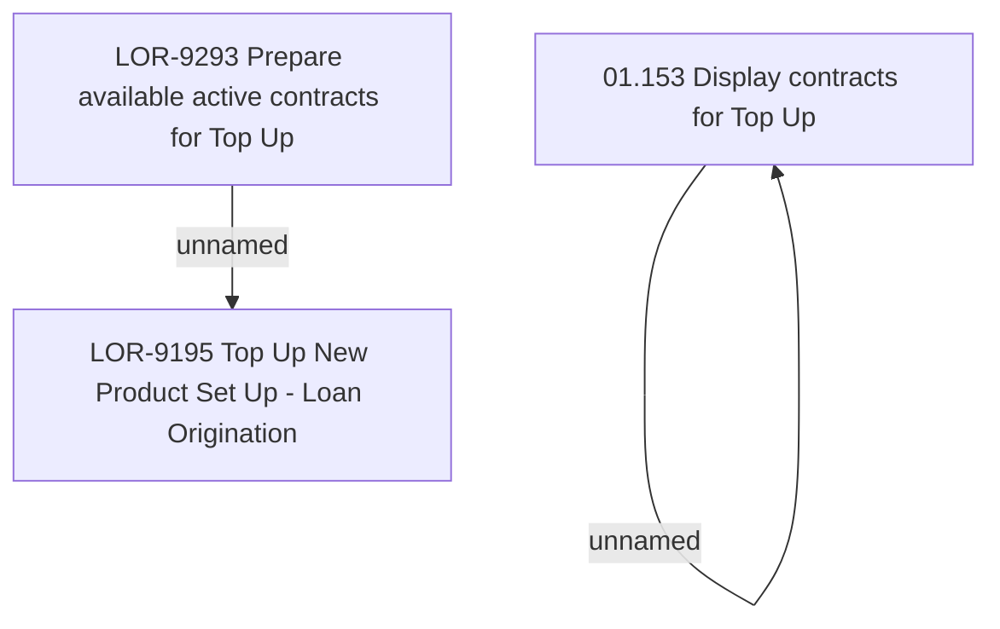

# LOR-9293 Prepare available active contracts for Top Up

```mermaid
graph TD
    n_01_153_Display_contracts_for_Top_Up["01.153 Display contracts for Top Up"]
    n_01_153_Display_contracts_for_Top_Up["01.153 Display contracts for Top Up"]
    LOR_9293_Prepare_available_active_contracts_for_Top_Up["LOR-9293 Prepare available active contracts for Top Up"]
    LOR_9195_Top_Up_New_Product_Set_Up_Loan_Origination["LOR-9195 Top Up New Product Set Up - Loan Origination"]
    LOR_9293_Prepare_available_active_contracts_for_Top_Up -->|unnamed| LOR_9195_Top_Up_New_Product_Set_Up_Loan_Origination
    n_01_153_Display_contracts_for_Top_Up -->|unnamed| n_01_153_Display_contracts_for_Top_Up
```
