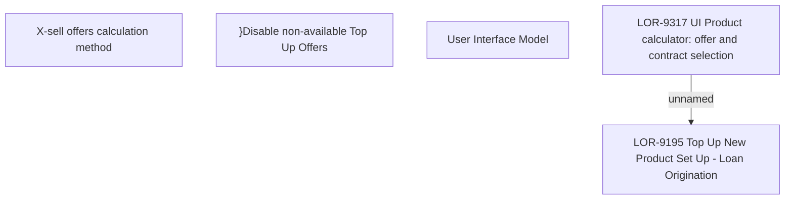

# LOR-9317 UI Product calculator: offer and contract selection

```mermaid
graph TD
    X_sell_offers_calculation_method["X-sell offers calculation method"]
    Disable_non_available_Top_Up_Offers["}Disable non-available Top Up Offers"]
    User_Interface_Model["User Interface Model"]
    LOR_9317_UI_Product_calculator_offer_and_contract_selection["LOR-9317 UI Product calculator: offer and contract selection"]
    LOR_9195_Top_Up_New_Product_Set_Up_Loan_Origination["LOR-9195 Top Up New Product Set Up - Loan Origination"]
    LOR_9317_UI_Product_calculator_offer_and_contract_selection -->|unnamed| LOR_9195_Top_Up_New_Product_Set_Up_Loan_Origination
```
