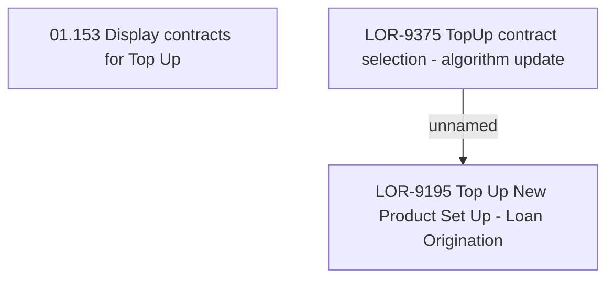

# LOR-9375 TopUp contract selection - algorithm update

```mermaid
graph TD
    n_01_153_Display_contracts_for_Top_Up["01.153 Display contracts for Top Up"]
    LOR_9375_TopUp_contract_selection_algorithm_update["LOR-9375 TopUp contract selection - algorithm update"]
    LOR_9195_Top_Up_New_Product_Set_Up_Loan_Origination["LOR-9195 Top Up New Product Set Up - Loan Origination"]
    LOR_9375_TopUp_contract_selection_algorithm_update -->|unnamed| LOR_9195_Top_Up_New_Product_Set_Up_Loan_Origination
```
