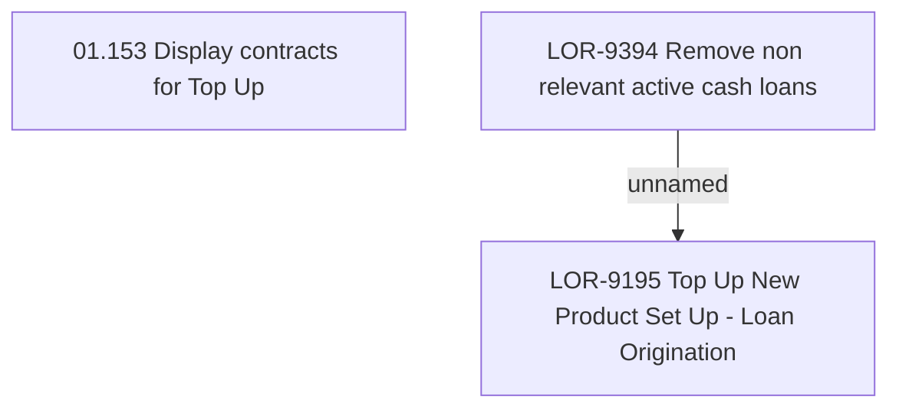

# LOR-9394 Remove non relevant active cash loans

- **Diagram Type**: Custom
- **Package**: HomerSelect/BSL/Requirements Model/Finished/LOR/LOR-9195 Top Up New Product Set Up - Loan Origination/LOR-9394 Remove non relevant active cash loans
- **Diagram ID**: 152420
- **Elements**: 3
- **Connectors**: 1

