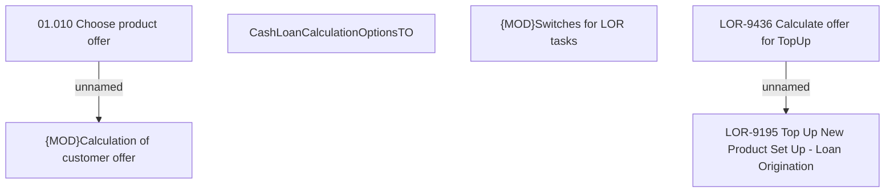

# LOR-9436 Calculate offer for TopUp

- **Diagram Type**: Custom
- **Package**: HomerSelect/BSL/Requirements Model/Finished/LOR/LOR-9195 Top Up New Product Set Up - Loan Origination/LOR-9436 Calculate offer for TopUp
- **Diagram ID**: 152421
- **Elements**: 6
- **Connectors**: 2

