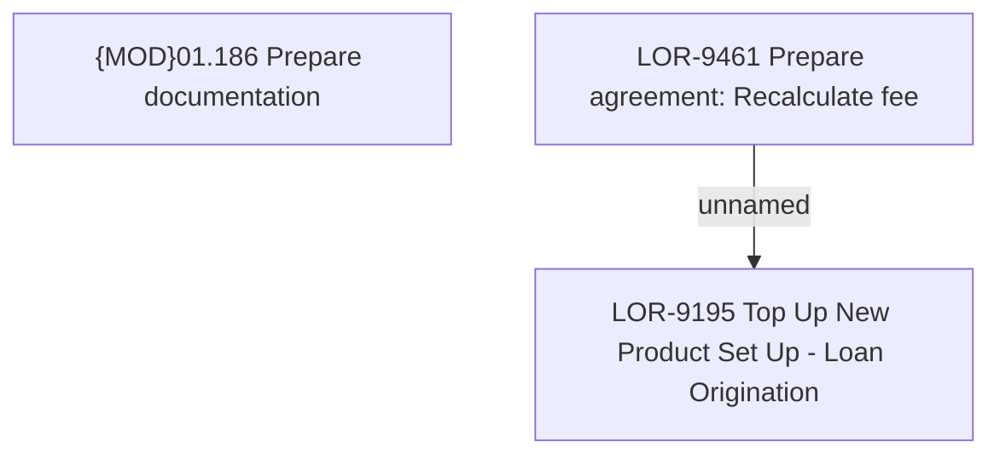

# LOR-9461 Prepare agreement: Recalculate fee

```mermaid
graph TD
    MOD_01_186_Prepare_documentation["{MOD}01.186 Prepare documentation"]
    LOR_9461_Prepare_agreement_Recalculate_fee["LOR-9461 Prepare agreement: Recalculate fee"]
    LOR_9195_Top_Up_New_Product_Set_Up_Loan_Origination["LOR-9195 Top Up New Product Set Up - Loan Origination"]
    LOR_9461_Prepare_agreement_Recalculate_fee -->|unnamed| LOR_9195_Top_Up_New_Product_Set_Up_Loan_Origination
```
