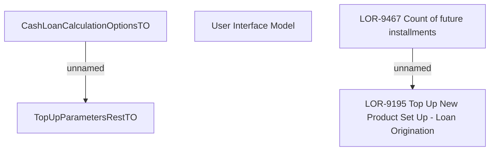

# LOR-9467 Count of future installments

```mermaid
graph TD
    CashLoanCalculationOptionsTO["CashLoanCalculationOptionsTO"]
    TopUpParametersRestTO["TopUpParametersRestTO"]
    User_Interface_Model["User Interface Model"]
    LOR_9467_Count_of_future_installments["LOR-9467 Count of future installments"]
    LOR_9195_Top_Up_New_Product_Set_Up_Loan_Origination["LOR-9195 Top Up New Product Set Up - Loan Origination"]
    LOR_9467_Count_of_future_installments -->|unnamed| LOR_9195_Top_Up_New_Product_Set_Up_Loan_Origination
    CashLoanCalculationOptionsTO -->|unnamed| TopUpParametersRestTO
```
