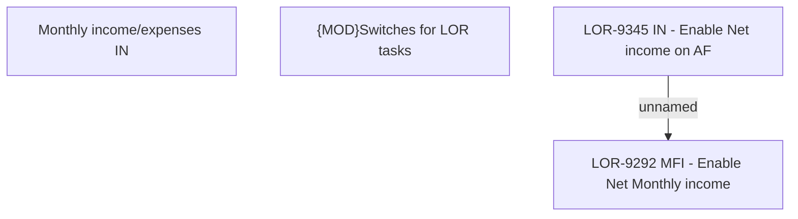

# LOR-9292 MFI - Enable Net Monthly income

```mermaid
graph TD
    Monthly_income_expenses_IN["Monthly income/expenses IN"]
    MOD_Switches_for_LOR_tasks["{MOD}Switches for LOR tasks"]
    LOR_9345_IN_Enable_Net_income_on_AF["LOR-9345 IN - Enable Net income on AF"]
    LOR_9292_MFI_Enable_Net_Monthly_income["LOR-9292 MFI - Enable Net Monthly income"]
    LOR_9345_IN_Enable_Net_income_on_AF -->|unnamed| LOR_9292_MFI_Enable_Net_Monthly_income
```
